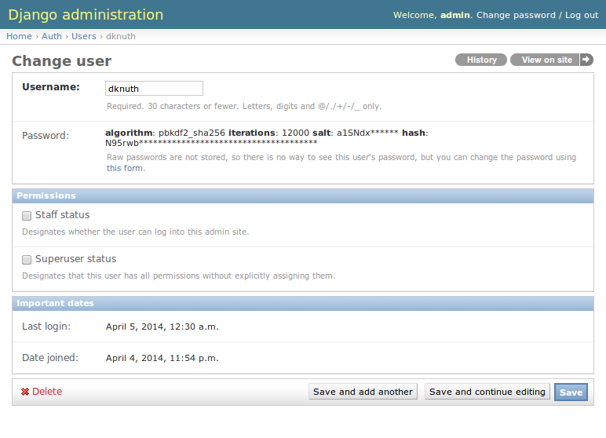

===============
User Management
===============

Authenticated users with the "super user" role will see a link in the page 
header labelled "Admin". This link will take you to the Django administrative 
interface where you can manage user accounts.

When editing a user account, note the checkboxes granting the following 
permissions:

Staff status
------------

Users with the "staff" role have access to the submissions page (see 
:doc:`managing_submissions`) and can view the contents of submissions using 
the web interface.

Superuser status
----------------

Users with the "superuser" role have full access to all features of the web 
application, including the Django administrative interface (as described on 
this page).

No permissions
--------------

Users with neither of the "staff" or "superuser" roles described above are 
treated as normal users, with access only to the "submit" page and the home 
page.